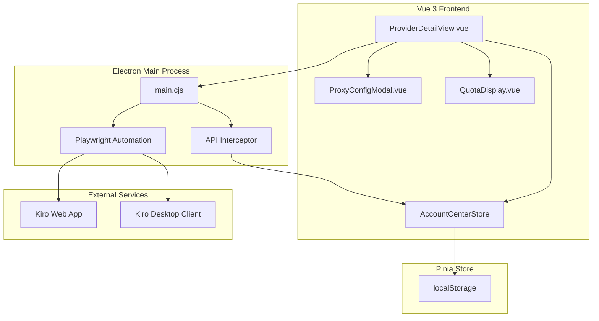
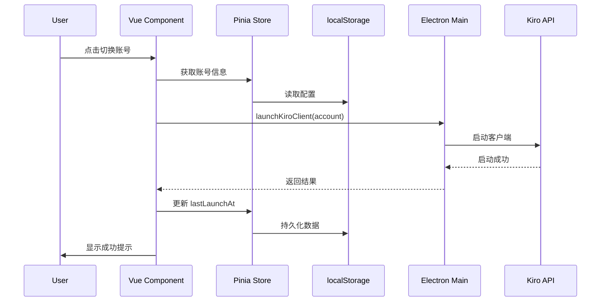
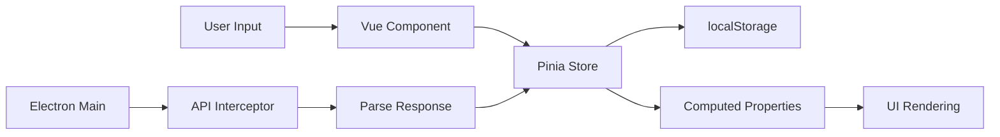

# 技术设计文档：账号中心界面改进

## 1. Overview

### 1.1 设计目标

本设计文档描述账号中心界面改进功能的技术实现方案，包括：
- 响应式卡片布局优化（280px 固定宽度，自动填充）
- 账号快速切换功能
- 反代配置管理
- 额度信息细化展示
- API 接口调研与集成

### 1.2 设计原则

1. **渐进增强**：新功能不破坏现有功能，保持向后兼容
2. **响应式优先**：优先考虑不同屏幕尺寸的用户体验
3. **性能优化**：最小化重渲染，优化大列表性能
4. **用户体验**：提供清晰的视觉反馈和错误提示
5. **数据持久化**：所有配置数据可靠存储到 localStorage

### 1.3 技术栈

- **前端框架**: Vue 3 (Composition API)
- **状态管理**: Pinia
- **样式方案**: Tailwind CSS
- **桌面环境**: Electron
- **浏览器自动化**: Playwright
- **构建工具**: Vite

---

## 2. Architecture

### 2.1 系统架构



### 2.2 模块划分

#### 2.2.1 前端模块

1. **ProviderDetailView.vue** (主视图)
   - 账号卡片列表渲染
   - 响应式布局控制
   - 账号切换逻辑
   - 反代配置触发

2. **ProxyConfigModal.vue** (新增组件)
   - 反代配置表单
   - 表单验证
   - 配置保存

3. **QuotaDisplay.vue** (新增组件)
   - 额度信息展示
   - 分段进度条
   - 额度刷新

4. **AccountCenterStore** (状态管理)
   - 账号数据管理
   - 配置数据持久化
   - 活跃账号判定

#### 2.2.2 后端模块

1. **Electron Main Process**
   - 客户端启动控制
   - API 拦截与解析
   - 浏览器自动化

2. **API Interceptor**
   - 拦截 Kiro API 请求
   - 提取额度信息
   - 提取模型列表

### 2.3 数据流



---

## 3. Components and Interfaces

### 3.1 组件设计

#### 3.1.1 ProviderDetailView.vue (修改)

**职责**：
- 渲染账号卡片列表
- 处理账号选择和切换
- 管理反代配置模态框状态

**新增功能**：
- 响应式卡片布局（CSS Grid auto-fill）
- 切换账号按钮
- 反代配置按钮
- 活跃账号标识

**关键方法**：
```javascript
// 判断是否为活跃账号
function isActiveAccount(account) {
  const lastLaunch = new Date(account.kiroClientLastLaunchAt);
  const now = new Date();
  const diffMinutes = (now - lastLaunch) / 1000 / 60;
  return diffMinutes <= 30;
}

// 切换账号
async function switchAccount(account) {
  if (isActiveAccount(account)) return;
  await launchSelectedKiroClient('switch');
}

// 打开反代配置
function openProxyConfig(account) {
  selectedAccountForProxy.value = account;
  showProxyModal.value = true;
}
```

**模板结构**：
```vue
<template>
  <div class="grid gap-3 grid-cols-[repeat(auto-fill,280px)]">
    <div v-for="item in accountList" :key="item.id" class="account-card">
      <!-- 卡片头部：切换和反代按钮 -->
      <div class="absolute top-3 right-3 flex gap-2">
        <button @click.stop="switchAccount(item)" :disabled="isActiveAccount(item)">
          <SwitchIcon />
        </button>
        <button @click.stop="openProxyConfig(item)" :class="{ 'text-green-400': item.proxyConfig?.enabled }">
          <ProxyIcon />
        </button>
      </div>
      
      <!-- 卡片内容 -->
      <QuotaDisplay :account="item" />
    </div>
  </div>
  
  <!-- 反代配置模态框 -->
  <ProxyConfigModal v-model:show="showProxyModal" :account="selectedAccountForProxy" />
</template>
```

#### 3.1.2 ProxyConfigModal.vue (新增)

**职责**：
- 显示反代配置表单
- 验证表单输入
- 保存配置到 store

**Props**：
```typescript
interface Props {
  show: boolean;
  account: Account | null;
}
```

**Emits**：
```typescript
interface Emits {
  (e: 'update:show', value: boolean): void;
  (e: 'save', config: ProxyConfig): void;
}
```

**数据结构**：
```javascript
const formData = reactive({
  enabled: false,
  server: '',
  port: 8080,
  protocol: 'http',
  username: '',
  password: ''
});
```

**验证规则**：
```javascript
function validateForm() {
  const errors = [];
  
  if (!formData.server) {
    errors.push('服务器地址不能为空');
  }
  
  if (formData.port < 1 || formData.port > 65535) {
    errors.push('端口号必须在 1-65535 之间');
  }
  
  if (formData.server && !isValidUrl(formData.server)) {
    errors.push('服务器地址格式不正确');
  }
  
  return errors;
}
```

**模板结构**：
```vue
<template>
  <Teleport to="body">
    <Transition name="modal">
      <div v-if="show" class="modal-overlay" @click.self="close">
        <div class="modal-content">
          <h2>反代配置</h2>
          
          <form @submit.prevent="save">
            <label>
              <input type="checkbox" v-model="formData.enabled" />
              启用反代
            </label>
            
            <label>
              服务器地址
              <input v-model="formData.server" required />
            </label>
            
            <label>
              端口
              <input type="number" v-model.number="formData.port" min="1" max="65535" required />
            </label>
            
            <label>
              协议
              <select v-model="formData.protocol">
                <option value="http">HTTP</option>
                <option value="https">HTTPS</option>
                <option value="socks5">SOCKS5</option>
              </select>
            </label>
            
            <label>
              用户名（可选）
              <input v-model="formData.username" />
            </label>
            
            <label>
              密码（可选）
              <input type="password" v-model="formData.password" />
            </label>
            
            <div class="actions">
              <button type="button" @click="close">取消</button>
              <button type="submit">保存</button>
            </div>
          </form>
        </div>
      </div>
    </Transition>
  </Teleport>
</template>
```

#### 3.1.3 QuotaDisplay.vue (新增)

**职责**：
- 显示账号额度信息
- 渲染分段进度条
- 处理额度刷新

**Props**：
```typescript
interface Props {
  account: Account;
}
```

**计算属性**：
```javascript
const quotaBreakdown = computed(() => {
  if (!props.account.quotaBreakdown) {
    // 降级方案：只显示总额度
    return {
      subscription: { used: 0, total: 0 },
      freeTier: { used: 0, total: 0 },
      bonus: { used: 0, total: 0 },
      total: {
        used: props.account.quotaUsed || 0,
        total: props.account.quotaTotal || 0
      }
    };
  }
  return props.account.quotaBreakdown;
});

const quotaSegments = computed(() => {
  const total = quotaBreakdown.value.total.total;
  if (!total) return [];
  
  return [
    {
      type: 'subscription',
      label: '套餐',
      used: quotaBreakdown.value.subscription.used,
      total: quotaBreakdown.value.subscription.total,
      percent: (quotaBreakdown.value.subscription.used / total) * 100,
      color: 'from-cyan-400 to-cyan-500'
    },
    {
      type: 'freeTier',
      label: '免费',
      used: quotaBreakdown.value.freeTier.used,
      total: quotaBreakdown.value.freeTier.total,
      percent: (quotaBreakdown.value.freeTier.used / total) * 100,
      color: 'from-emerald-400 to-emerald-500'
    },
    {
      type: 'bonus',
      label: '福利',
      used: quotaBreakdown.value.bonus.used,
      total: quotaBreakdown.value.bonus.total,
      percent: (quotaBreakdown.value.bonus.used / total) * 100,
      color: 'from-purple-400 to-purple-500'
    }
  ].filter(segment => segment.total > 0);
});
```

**模板结构**：
```vue
<template>
  <div class="quota-display">
    <div class="quota-header">
      <span>额度用量</span>
      <button @click="refreshQuota" :disabled="refreshing">
        <RefreshIcon :class="{ 'animate-spin': refreshing }" />
      </button>
    </div>
    
    <!-- 总额度 -->
    <div class="quota-total">
      <span>{{ quotaBreakdown.total.used }} / {{ quotaBreakdown.total.total }}</span>
    </div>
    
    <!-- 分段进度条 -->
    <div class="quota-bar">
      <div v-for="segment in quotaSegments" :key="segment.type"
           class="segment"
           :class="`bg-gradient-to-r ${segment.color}`"
           :style="{ width: segment.percent + '%' }"
           :title="`${segment.label}: ${segment.used}/${segment.total}`">
      </div>
    </div>
    
    <!-- 额度详情 -->
    <div class="quota-details">
      <div v-for="segment in quotaSegments" :key="segment.type" class="detail-item">
        <span class="label">{{ segment.label }}</span>
        <span class="value">{{ segment.used }}/{{ segment.total }}</span>
        <span v-if="segment.used >= segment.total" class="warning">⚠️</span>
      </div>
    </div>
  </div>
</template>
```

### 3.2 接口设计

#### 3.2.1 Electron IPC 接口

**launchKiroClient** (已有，需扩展)
```typescript
interface LaunchKiroClientParams {
  accountId: string;
  email: string;
  username: string;
  executablePath?: string;
  workspacePath?: string;
  proxyConfig?: ProxyConfig; // 新增
}

interface LaunchKiroClientResponse {
  ok: boolean;
  profilePath: string;
  executablePath: string;
  error?: string;
}
```

**captureKiroWebAccount** (已有，需扩展)
```typescript
interface CaptureKiroWebAccountParams {
  url: string;
  selectors: object;
  mailbox: object;
  proxyConfig?: ProxyConfig; // 新增
}

interface CaptureKiroWebAccountResponse {
  ok: boolean;
  account: {
    email: string;
    username: string;
    storageStatePath: string;
    quotaUsed: number;
    quotaTotal: number;
    quotaBreakdown?: QuotaBreakdown; // 新增
    availableModels: string[];
    discoveredApis: ApiRecord[];
  };
  error?: string;
}
```

#### 3.2.2 Store 接口

**AccountCenterStore** (扩展)
```typescript
interface AccountCenterStore {
  // 现有方法
  addAccount(providerId: string, payload: AccountPayload): Account;
  updateAccount(providerId: string, accountId: string, patch: Partial<Account>): Account;
  setSettings(providerId: string, patch: object): void;
  
  // 新增方法
  setProxyConfig(providerId: string, accountId: string, config: ProxyConfig): void;
  getActiveAccount(providerId: string): Account | null;
  refreshQuota(providerId: string, accountId: string): Promise<void>;
}
```

---

## 4. Data Models

### 4.1 核心数据模型

#### 4.1.1 Account (扩展)

```typescript
interface Account {
  // 现有字段
  id: string;
  createdAt: string;
  status: 'success' | 'failed' | 'pending';
  email: string;
  username: string;
  password: string;
  localFilePath: string;
  note: string;
  ssoTokenPreview: string;
  kiroProfilePath: string;
  kiroClientBoundAt: string;
  kiroClientLastLaunchAt: string;
  kiroExecutablePath: string;
  authMode: 'web-session' | 'local-file' | '';
  webProfilePath: string;
  storageStatePath: string;
  ssoCookieName: string;
  quotaUsed: number;
  quotaTotal: number;
  availableModels: string[];
  discoveredApis: ApiRecord[];
  lastLoginUrl: string;
  addedAt: string;
  
  // 新增字段
  proxyConfig?: ProxyConfig;
  quotaBreakdown?: QuotaBreakdown;
  quotaLastSyncAt?: string;
}
```

#### 4.1.2 ProxyConfig (新增)

```typescript
interface ProxyConfig {
  enabled: boolean;
  server: string;
  port: number;
  protocol: 'http' | 'https' | 'socks5';
  username?: string;
  password?: string;
}
```

#### 4.1.3 QuotaBreakdown (新增)

```typescript
interface QuotaBreakdown {
  subscription: QuotaSegment;
  freeTier: QuotaSegment;
  bonus: QuotaSegment;
  total: QuotaSegment;
}

interface QuotaSegment {
  used: number;
  total: number;
  type?: 'paid' | 'free' | 'promotional';
}
```

#### 4.1.4 ApiRecord (现有)

```typescript
interface ApiRecord {
  method: string;
  url: string;
  status: number;
  timestamp: string;
}
```

### 4.2 数据存储结构

#### 4.2.1 localStorage 结构

```json
{
  "all2api-account-center-v1": {
    "providers": [...],
    "accountsByProvider": {
      "kiro": [
        {
          "id": "kiro_1234567890_abc",
          "email": "user@example.com",
          "username": "kiro_user",
          "quotaUsed": 150,
          "quotaTotal": 500,
          "quotaBreakdown": {
            "subscription": { "used": 100, "total": 300, "type": "paid" },
            "freeTier": { "used": 50, "total": 200, "type": "free" },
            "bonus": { "used": 0, "total": 0, "type": "promotional" }
          },
          "proxyConfig": {
            "enabled": true,
            "server": "proxy.example.com",
            "port": 8080,
            "protocol": "http",
            "username": "proxyuser",
            "password": "encrypted_password"
          },
          "kiroClientLastLaunchAt": "2024-01-15 14:30:00",
          "quotaLastSyncAt": "2024-01-15 14:25:00"
        }
      ]
    },
    "settingsByProvider": {...}
  }
}
```

### 4.3 数据流转



### 4.4 数据验证

#### 4.4.1 ProxyConfig 验证

```javascript
function validateProxyConfig(config) {
  const errors = [];
  
  if (!config.server || typeof config.server !== 'string') {
    errors.push('服务器地址必须是非空字符串');
  }
  
  if (!Number.isInteger(config.port) || config.port < 1 || config.port > 65535) {
    errors.push('端口号必须是 1-65535 之间的整数');
  }
  
  if (!['http', 'https', 'socks5'].includes(config.protocol)) {
    errors.push('协议类型必须是 http、https 或 socks5');
  }
  
  if (config.username && typeof config.username !== 'string') {
    errors.push('用户名必须是字符串');
  }
  
  if (config.password && typeof config.password !== 'string') {
    errors.push('密码必须是字符串');
  }
  
  return errors;
}
```

#### 4.4.2 QuotaBreakdown 验证

```javascript
function validateQuotaBreakdown(breakdown) {
  const errors = [];
  
  const segments = ['subscription', 'freeTier', 'bonus', 'total'];
  for (const segment of segments) {
    if (!breakdown[segment]) {
      errors.push(`缺少 ${segment} 字段`);
      continue;
    }
    
    const { used, total } = breakdown[segment];
    
    if (typeof used !== 'number' || used < 0) {
      errors.push(`${segment}.used 必须是非负数`);
    }
    
    if (typeof total !== 'number' || total < 0) {
      errors.push(`${segment}.total 必须是非负数`);
    }
    
    if (used > total) {
      errors.push(`${segment}.used 不能大于 ${segment}.total`);
    }
  }
  
  return errors;
}
```

---

## 5. Error Handling

### 5.1 错误分类

#### 5.1.1 用户输入错误
- **反代配置验证失败**
  - 错误码: `PROXY_INVALID_SERVER`
  - 处理: 显示表单验证错误，阻止保存
  - 用户提示: "服务器地址格式不正确，请输入有效的 URL"

- **端口号超出范围**
  - 错误码: `PROXY_INVALID_PORT`
  - 处理: 显示表单验证错误
  - 用户提示: "端口号必须在 1-65535 之间"

#### 5.1.2 系统错误
- **localStorage 存储失败**
  - 错误码: `STORAGE_QUOTA_EXCEEDED`
  - 处理: 提示用户清理浏览器数据
  - 用户提示: "存储空间不足，请清理浏览器数据后重试"

- **Electron IPC 通信失败**
  - 错误码: `IPC_COMMUNICATION_ERROR`
  - 处理: 降级到 Web 模式，禁用桌面功能
  - 用户提示: "桌面功能不可用，请使用 Electron 模式运行"

#### 5.1.3 网络错误
- **客户端启动失败**
  - 错误码: `CLIENT_LAUNCH_FAILED`
  - 处理: 显示详细错误信息，提供重试选项
  - 用户提示: "客户端启动失败: {具体原因}。请检查客户端路径配置"

- **API 请求超时**
  - 错误码: `API_TIMEOUT`
  - 处理: 显示超时提示，提供重试选项
  - 用户提示: "请求超时，请检查网络连接后重试"

#### 5.1.4 数据错误
- **额度数据解析失败**
  - 错误码: `QUOTA_PARSE_ERROR`
  - 处理: 降级显示总额度，记录错误日志
  - 用户提示: "额度信息同步失败，显示为待同步状态"

- **账号数据损坏**
  - 错误码: `ACCOUNT_DATA_CORRUPTED`
  - 处理: 尝试恢复默认值，提示用户重新添加账号
  - 用户提示: "账号数据异常，建议重新添加该账号"

### 5.2 错误处理策略

#### 5.2.1 全局错误处理

```javascript
// 全局错误处理器
function handleError(error, context) {
  console.error(`[${context}]`, error);
  
  // 记录错误日志
  logError({
    context,
    message: error.message,
    stack: error.stack,
    timestamp: new Date().toISOString()
  });
  
  // 显示用户友好的错误提示
  const userMessage = getUserFriendlyMessage(error);
  showToast(userMessage, 'error');
  
  // 上报错误（可选）
  if (shouldReportError(error)) {
    reportError(error, context);
  }
}
```

#### 5.2.2 组件级错误处理

```javascript
// ProxyConfigModal.vue
async function saveProxyConfig() {
  try {
    const errors = validateProxyConfig(formData);
    if (errors.length > 0) {
      throw new ValidationError(errors.join('; '));
    }
    
    await center.setProxyConfig(providerId.value, account.value.id, formData);
    showToast('反代配置保存成功', 'success');
    emit('update:show', false);
  } catch (error) {
    if (error instanceof ValidationError) {
      formErrors.value = error.errors;
    } else {
      handleError(error, 'ProxyConfigModal.saveProxyConfig');
    }
  }
}
```

#### 5.2.3 Store 级错误处理

```javascript
// accountCenter.js
actions: {
  async refreshQuota(providerId, accountId) {
    try {
      if (!window.desktop?.automation?.getQuotaInfo) {
        throw new Error('额度同步功能不可用');
      }
      
      const account = this.accountsByProvider[providerId]?.find(a => a.id === accountId);
      if (!account) {
        throw new Error('账号不存在');
      }
      
      const quotaInfo = await window.desktop.automation.getQuotaInfo({
        accountId,
        email: account.email
      });
      
      this.updateAccount(providerId, accountId, {
        quotaUsed: quotaInfo.used,
        quotaTotal: quotaInfo.total,
        quotaBreakdown: quotaInfo.breakdown,
        quotaLastSyncAt: new Date().toISOString()
      });
    } catch (error) {
      handleError(error, 'AccountCenterStore.refreshQuota');
      throw error; // 重新抛出，让调用者处理
    }
  }
}
```

### 5.3 错误恢复机制

#### 5.3.1 自动重试

```javascript
async function retryOperation(operation, maxRetries = 3, delay = 1000) {
  for (let i = 0; i < maxRetries; i++) {
    try {
      return await operation();
    } catch (error) {
      if (i === maxRetries - 1) throw error;
      await new Promise(resolve => setTimeout(resolve, delay * (i + 1)));
    }
  }
}
```

#### 5.3.2 降级方案

```javascript
// 额度显示降级
const quotaDisplay = computed(() => {
  if (account.value.quotaBreakdown) {
    // 优先显示细分额度
    return renderDetailedQuota(account.value.quotaBreakdown);
  } else if (account.value.quotaTotal) {
    // 降级显示总额度
    return renderSimpleQuota(account.value.quotaUsed, account.value.quotaTotal);
  } else {
    // 最终降级：显示待同步
    return '待同步';
  }
});
```

#### 5.3.3 数据恢复

```javascript
// localStorage 数据恢复
function loadWithFallback() {
  try {
    const data = JSON.parse(localStorage.getItem(STORAGE_KEY));
    return validateAndMerge(data, createDefaults());
  } catch (error) {
    console.warn('数据加载失败，使用默认值', error);
    return createDefaults();
  }
}
```

### 5.4 用户反馈

#### 5.4.1 Toast 通知

```javascript
function showToast(message, type = 'info', duration = 3000) {
  // 使用现有的日志系统或添加 Toast 组件
  if (type === 'error') {
    pushLog(`❌ ${message}`);
  } else if (type === 'success') {
    pushLog(`✅ ${message}`);
  } else {
    pushLog(`ℹ️ ${message}`);
  }
}
```

#### 5.4.2 加载状态

```javascript
const loadingStates = reactive({
  switchingAccount: false,
  savingProxy: false,
  refreshingQuota: false
});

// 使用示例
async function switchAccount(account) {
  loadingStates.switchingAccount = true;
  try {
    await launchKiroClient(account);
  } finally {
    loadingStates.switchingAccount = false;
  }
}
```

---

## 6. Testing Strategy

### 6.1 测试方法概述

本功能采用**混合测试策略**，结合以下测试方法：

1. **单元测试** (Unit Tests) - 测试纯函数和工具方法
2. **组件测试** (Component Tests) - 测试 Vue 组件的行为
3. **集成测试** (Integration Tests) - 测试组件与 Store 的交互
4. **端到端测试** (E2E Tests) - 测试完整的用户流程
5. **快照测试** (Snapshot Tests) - 测试 UI 渲染结果
6. **属性测试** (Property-Based Tests) - 测试数据验证和计算逻辑

### 6.2 PBT 适用性评估

**本功能不完全适合 Property-Based Testing**，原因如下：

1. **UI 渲染和布局** - 响应式卡片布局是 CSS 驱动的视觉效果，不适合 PBT
   - 替代方案：使用快照测试和视觉回归测试

2. **UI 交互** - 按钮点击、模态框显示等交互行为
   - 替代方案：使用组件测试和 E2E 测试

3. **简单 CRUD 操作** - 账号数据的增删改查
   - 替代方案：使用示例测试

**部分逻辑适合 PBT**：

1. **配置验证逻辑** - `validateProxyConfig` 函数
   - 可以生成随机配置对象，验证验证规则的正确性

2. **额度计算逻辑** - 额度百分比、分段计算
   - 可以生成随机额度数据，验证计算结果的正确性

3. **活跃账号判定** - `isActiveAccount` 函数
   - 可以生成随机时间戳，验证判定逻辑

### 6.3 测试计划

#### 6.3.1 单元测试

**测试目标**: 纯函数和工具方法

**测试用例**:

1. **validateProxyConfig** (使用 PBT)
   ```javascript
   // 使用 fast-check 进行属性测试
   test('validateProxyConfig should reject invalid configurations', () => {
     fc.assert(
       fc.property(
         fc.record({
           enabled: fc.boolean(),
           server: fc.string(),
           port: fc.integer(),
           protocol: fc.constantFrom('http', 'https', 'socks5', 'invalid'),
           username: fc.option(fc.string()),
           password: fc.option(fc.string())
         }),
         (config) => {
           const errors = validateProxyConfig(config);
           
           // 属性1: 端口号超出范围应该有错误
           if (config.port < 1 || config.port > 65535) {
             expect(errors.length).toBeGreaterThan(0);
             expect(errors.some(e => e.includes('端口号'))).toBe(true);
           }
           
           // 属性2: 无效协议应该有错误
           if (!['http', 'https', 'socks5'].includes(config.protocol)) {
             expect(errors.length).toBeGreaterThan(0);
             expect(errors.some(e => e.includes('协议'))).toBe(true);
           }
           
           // 属性3: 空服务器地址应该有错误
           if (!config.server) {
             expect(errors.length).toBeGreaterThan(0);
             expect(errors.some(e => e.includes('服务器'))).toBe(true);
           }
         }
       ),
       { numRuns: 100 }
     );
   });
   ```

2. **isActiveAccount**
   ```javascript
   test('isActiveAccount should identify active accounts within 30 minutes', () => {
     const now = new Date();
     
     // 29分钟前 - 应该是活跃的
     const activeAccount = {
       kiroClientLastLaunchAt: new Date(now - 29 * 60 * 1000).toISOString()
     };
     expect(isActiveAccount(activeAccount)).toBe(true);
     
     // 31分钟前 - 应该不是活跃的
     const inactiveAccount = {
       kiroClientLastLaunchAt: new Date(now - 31 * 60 * 1000).toISOString()
     };
     expect(isActiveAccount(inactiveAccount)).toBe(false);
     
     // 没有启动记录 - 应该不是活跃的
     const neverLaunchedAccount = {
       kiroClientLastLaunchAt: ''
     };
     expect(isActiveAccount(neverLaunchedAccount)).toBe(false);
   });
   ```

3. **quotaPercent** (使用 PBT)
   ```javascript
   test('quotaPercent should always return value between 0 and 100', () => {
     fc.assert(
       fc.property(
         fc.record({
           quotaUsed: fc.nat(),
           quotaTotal: fc.nat()
         }),
         (account) => {
           const percent = quotaPercent(account);
           expect(percent).toBeGreaterThanOrEqual(0);
           expect(percent).toBeLessThanOrEqual(100);
           
           // 属性: 如果 total 为 0，应该返回 0
           if (account.quotaTotal === 0) {
             expect(percent).toBe(0);
           }
           
           // 属性: 如果 used > total，应该返回 100
           if (account.quotaUsed > account.quotaTotal && account.quotaTotal > 0) {
             expect(percent).toBe(100);
           }
         }
       ),
       { numRuns: 100 }
     );
   });
   ```

#### 6.3.2 组件测试

**测试目标**: Vue 组件的行为和交互

**测试用例**:

1. **ProxyConfigModal.vue**
   ```javascript
   test('should validate form before saving', async () => {
     const wrapper = mount(ProxyConfigModal, {
       props: {
         show: true,
         account: mockAccount
       }
     });
     
     // 填写无效数据
     await wrapper.find('input[name="server"]').setValue('');
     await wrapper.find('input[name="port"]').setValue('99999');
     
     // 尝试保存
     await wrapper.find('form').trigger('submit');
     
     // 应该显示验证错误
     expect(wrapper.find('.error-message').exists()).toBe(true);
     expect(wrapper.emitted('save')).toBeUndefined();
   });
   
   test('should emit save event with valid data', async () => {
     const wrapper = mount(ProxyConfigModal, {
       props: {
         show: true,
         account: mockAccount
       }
     });
     
     // 填写有效数据
     await wrapper.find('input[name="server"]').setValue('proxy.example.com');
     await wrapper.find('input[name="port"]').setValue('8080');
     await wrapper.find('select[name="protocol"]').setValue('http');
     
     // 保存
     await wrapper.find('form').trigger('submit');
     
     // 应该触发 save 事件
     expect(wrapper.emitted('save')).toBeTruthy();
     expect(wrapper.emitted('save')[0][0]).toMatchObject({
       server: 'proxy.example.com',
       port: 8080,
       protocol: 'http'
     });
   });
   ```

2. **QuotaDisplay.vue**
   ```javascript
   test('should display detailed quota when breakdown is available', () => {
     const account = {
       quotaUsed: 150,
       quotaTotal: 500,
       quotaBreakdown: {
         subscription: { used: 100, total: 300 },
         freeTier: { used: 50, total: 200 },
         bonus: { used: 0, total: 0 }
       }
     };
     
     const wrapper = mount(QuotaDisplay, {
       props: { account }
     });
     
     expect(wrapper.text()).toContain('套餐');
     expect(wrapper.text()).toContain('100/300');
     expect(wrapper.text()).toContain('免费');
     expect(wrapper.text()).toContain('50/200');
   });
   
   test('should fallback to simple quota when breakdown is missing', () => {
     const account = {
       quotaUsed: 150,
       quotaTotal: 500
     };
     
     const wrapper = mount(QuotaDisplay, {
       props: { account }
     });
     
     expect(wrapper.text()).toContain('150 / 500');
     expect(wrapper.text()).not.toContain('套餐');
   });
   ```

#### 6.3.3 集成测试

**测试目标**: 组件与 Store 的交互

**测试用例**:

1. **账号切换流程**
   ```javascript
   test('should update lastLaunchAt when switching account', async () => {
     const store = useAccountCenterStore();
     const account = store.addAccount('kiro', mockAccountData);
     
     // 模拟切换账号
     await switchAccount(account);
     
     // 验证 lastLaunchAt 已更新
     const updated = store.accountsByProvider.kiro.find(a => a.id === account.id);
     expect(updated.kiroClientLastLaunchAt).toBeTruthy();
     expect(new Date(updated.kiroClientLastLaunchAt).getTime()).toBeCloseTo(Date.now(), -3);
   });
   ```

2. **反代配置保存**
   ```javascript
   test('should persist proxy config to localStorage', async () => {
     const store = useAccountCenterStore();
     const account = store.addAccount('kiro', mockAccountData);
     
     const proxyConfig = {
       enabled: true,
       server: 'proxy.example.com',
       port: 8080,
       protocol: 'http'
     };
     
     store.setProxyConfig('kiro', account.id, proxyConfig);
     
     // 验证配置已保存
     const updated = store.accountsByProvider.kiro.find(a => a.id === account.id);
     expect(updated.proxyConfig).toEqual(proxyConfig);
     
     // 验证 localStorage 已更新
     const stored = JSON.parse(localStorage.getItem('all2api-account-center-v1'));
     const storedAccount = stored.accountsByProvider.kiro.find(a => a.id === account.id);
     expect(storedAccount.proxyConfig).toEqual(proxyConfig);
   });
   ```

#### 6.3.4 快照测试

**测试目标**: UI 渲染结果

**测试用例**:

1. **账号卡片渲染**
   ```javascript
   test('should match snapshot for account card', () => {
     const wrapper = mount(AccountCard, {
       props: {
         account: mockAccount,
         isActive: false
       }
     });
     
     expect(wrapper.html()).toMatchSnapshot();
   });
   
   test('should match snapshot for active account card', () => {
     const wrapper = mount(AccountCard, {
       props: {
         account: mockAccount,
         isActive: true
       }
     });
     
     expect(wrapper.html()).toMatchSnapshot();
   });
   ```

#### 6.3.5 端到端测试

**测试目标**: 完整的用户流程

**测试用例**:

1. **配置反代并切换账号**
   ```javascript
   test('user can configure proxy and switch account', async () => {
     // 打开应用
     await page.goto('http://localhost:5173/provider/kiro');
     
     // 点击反代按钮
     await page.click('[data-testid="proxy-button"]');
     
     // 填写反代配置
     await page.fill('input[name="server"]', 'proxy.example.com');
     await page.fill('input[name="port"]', '8080');
     await page.selectOption('select[name="protocol"]', 'http');
     
     // 保存配置
     await page.click('button[type="submit"]');
     
     // 验证配置已保存（反代按钮变绿）
     await expect(page.locator('[data-testid="proxy-button"]')).toHaveClass(/text-green/);
     
     // 点击切换账号
     await page.click('[data-testid="switch-button"]');
     
     // 验证客户端启动（这里需要 mock Electron IPC）
     await expect(page.locator('.toast')).toContainText('已拉起 Kiro 客户端');
   });
   ```

### 6.4 测试覆盖率目标

- **单元测试**: 90% 代码覆盖率
- **组件测试**: 80% 组件覆盖率
- **集成测试**: 覆盖所有关键用户流程
- **E2E 测试**: 覆盖 3-5 个核心场景

### 6.5 测试工具

- **单元测试**: Vitest
- **组件测试**: @vue/test-utils + Vitest
- **属性测试**: fast-check
- **E2E 测试**: Playwright
- **快照测试**: Vitest snapshots

### 6.6 测试执行

```json
{
  "scripts": {
    "test": "vitest",
    "test:unit": "vitest run --coverage",
    "test:e2e": "playwright test",
    "test:watch": "vitest watch"
  }
}
```

---

## 7. Implementation Plan

### 7.1 实施阶段

#### 阶段 1: 响应式布局 + 切换账号 (1-2 天)

**任务**:
1. 修改 ProviderDetailView.vue 的卡片布局为 CSS Grid auto-fill
2. 添加切换账号按钮和逻辑
3. 实现活跃账号判定
4. 添加加载状态和错误处理
5. 编写单元测试和组件测试

**验收标准**:
- 卡片在不同屏幕尺寸下正确显示
- 切换账号功能正常工作
- 活跃账号有明确的视觉标识
- 测试覆盖率达到 80%

#### 阶段 2: API 调研 + 额度信息细化 (2-3 天)

**任务**:
1. 调研 Kiro API，识别额度相关接口
2. 更新 `isInterestingKiroApi` 函数
3. 实现 `extractUsageAndModels` 函数的额度细分提取
4. 创建 QuotaDisplay.vue 组件
5. 实现额度刷新功能
6. 编写 API 调研文档
7. 编写单元测试和组件测试

**验收标准**:
- 能够正确提取细分额度信息
- QuotaDisplay 组件正确显示各类额度
- 降级方案正常工作
- API 调研文档完整
- 测试覆盖率达到 80%

#### 阶段 3: 反代配置功能 (2-3 天)

**任务**:
1. 创建 ProxyConfigModal.vue 组件
2. 实现表单验证逻辑
3. 扩展 AccountCenterStore 的 setProxyConfig 方法
4. 实现配置持久化
5. 添加反代按钮和视觉标识
6. 编写单元测试、组件测试和集成测试

**验收标准**:
- 反代配置表单正常工作
- 配置数据正确保存到 localStorage
- 已配置账号有明确的视觉标识
- 测试覆盖率达到 80%

#### 阶段 4: 集成测试 + 文档 (1 天)

**任务**:
1. 编写端到端测试
2. 更新用户文档
3. 代码审查和优化
4. 性能测试

**验收标准**:
- E2E 测试覆盖核心场景
- 用户文档完整
- 性能指标达标

### 7.2 风险和缓解

**风险 1**: API 结构变化导致额度提取失败
- **缓解**: 使用灵活的字段匹配，提供降级方案

**风险 2**: 客户端启动失败
- **缓解**: 提供详细错误提示和重试机制

**风险 3**: localStorage 配额不足
- **缓解**: 实现配置导出/导入功能

### 7.3 性能优化

1. **虚拟滚动**: 如果账号数量超过 100 个，使用虚拟滚动
2. **防抖**: 窗口 resize 事件使用防抖
3. **懒加载**: 反代配置模态框按需加载
4. **缓存**: 额度信息缓存 5 分钟

---

## 8. Appendix

### 8.1 CSS Grid 布局示例

```css
.account-grid {
  display: grid;
  grid-template-columns: repeat(auto-fill, 280px);
  gap: 12px;
  justify-content: start;
}

@media (min-width: 1920px) {
  .account-grid {
    /* 约 6 个卡片/行 */
  }
}

@media (min-width: 2560px) {
  .account-grid {
    /* 约 8 个卡片/行 */
  }
}
```

### 8.2 Tailwind CSS 配置

```javascript
// tailwind.config.js
module.exports = {
  theme: {
    extend: {
      gridTemplateColumns: {
        'auto-fill-280': 'repeat(auto-fill, 280px)'
      }
    }
  }
}
```

### 8.3 API 调研模板

```markdown
# Kiro API 调研

## 额度信息 API

### 端点
- URL: `/api/v1/usage`
- Method: GET
- Headers: `Authorization: Bearer {token}`

### 响应结构
\`\`\`json
{
  "usage": {
    "subscription": {
      "used": 100,
      "total": 300,
      "type": "paid"
    },
    "freeTier": {
      "used": 50,
      "total": 200,
      "type": "free"
    },
    "bonus": {
      "used": 0,
      "total": 0,
      "type": "promotional"
    }
  },
  "models": ["Kiro", "Claude Sonnet", "Claude Haiku"]
}
\`\`\`

### 字段映射
- `usage.subscription` → `quotaBreakdown.subscription`
- `usage.freeTier` → `quotaBreakdown.freeTier`
- `usage.bonus` → `quotaBreakdown.bonus`
```

### 8.4 参考资料

- [Vue 3 文档](https://vuejs.org/)
- [Pinia 文档](https://pinia.vuejs.org/)
- [Tailwind CSS Grid](https://tailwindcss.com/docs/grid-template-columns)
- [fast-check 文档](https://fast-check.dev/)
- [Playwright 文档](https://playwright.dev/)

---

**文档版本**: 1.0  
**创建日期**: 2024-01-15  
**最后更新**: 2024-01-15  
**作者**: Kiro AI Agent
